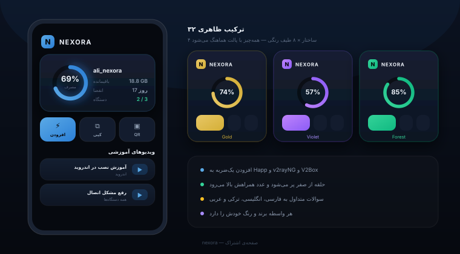

<div align="center">


<a href="https://t.me/yanexoravpn"></a>
<a href="https://t.me/crm_nexoravpn"></a>

**[فارسی](#فارسی)** · **[English](#english)**



</div>

<div dir="rtl">

## فارسی

اگر کانفیگ 3x-ui را از راه تلگرام می‌فروشید، این صحنه را می‌شناسید: مشتری ساعت سه صبح پول می‌زند، رسید را می‌فرستد و منتظر می‌ماند تا شما بیدار شوید و کانفیگش را دستی بسازید.

نکسورا این کار را از دوش شما برمی‌دارد. ربات تلگرامی‌اش پلن‌ها را می‌فروشد، رسید را می‌گیرد، کانفیگ را در 3x-ui می‌سازد و به مشتری تحویل می‌دهد. سفارش‌ها، کاربران و فروش را هم در پنل مدیریت یک‌جا می‌بینید.

### دو نسخه

| | Community (رایگان) | Pro |
|:--|:--:|:--:|
| ربات فروش: پلن‌ها، کارت‌به‌کارت با رسید، تحویل خودکار، تمدید، یادآوری انقضا | ✓ | ✓ |
| کیف پول و تست رایگان | ✓ | ✓ |
| صندوق پشتیبانی داخل ربات | ✓ | ✓ |
| پنل مدیریت: سفارش‌ها، کاربران، پلن‌ها، متن‌ها، گزارش فروش ساده، بکاپ، به‌روزرسانی | ✓ | ✓ |
| صفحه اشتراک | یک قالب | همه‌ی قالب‌ها |
| مانیتورینگ | همین سرور | چند سرور، تانل، سلامت و ترافیک |
| مینی‌اپ تلگرام و طراح پوسته | — | ✓ |
| سکه، دعوت، کد تخفیف، پیگیری بعد از تست و بازگرداندن مشتری | — | ✓ |
| همکاری در فروش و تسویه | — | ✓ |
| پنل نمایندگی، ربات نماینده، اشتراک فروشگاه نماینده | — | ✓ |
| حسابداری واسطه‌ها: صورتحساب PDF، دفتر، هزینه‌ها | — | ✓ |
| عیب‌یابی اتصال، اینباندها، فایروال، تشخیص نفوذ | — | ✓ |
| قیف فروش، نظرسنجی مشتری، پیش‌نمایش ربات | — | ✓ |
| ارسال به کانال و نویسنده‌ی هوشمند | — | ✓ |

بخش‌های Pro در نسخه‌ی رایگان هم هستند، ولی قفل‌اند؛ پیش از خرید می‌بینید هر کدام چه می‌کند. هر مجوز Pro برای یک سرور است و ماهانه یا سالانه از [@crm_nexoravpn](https://t.me/crm_nexoravpn) فروخته می‌شود.

اگر مجوز تمام شود، فقط بخش‌های Pro دوباره قفل می‌شوند. کانفیگ مشتری‌هایتان سر جایش می‌ماند، تمدید و خرید از ربات کار می‌کند و هیچ داده‌ای پاک نمی‌شود.

### نصب

پیش‌نیاز: اوبونتو ۲۰.۰۴ به بالا یا دبیان ۱۱ به بالا، 3x-ui که از قبل نصب شده باشد، دامنه‌ای که به همین سرور اشاره کند، و یک گیگابایت رم.

</div>

```bash
git clone https://github.com/NexoraImen/nexora-panel.git
cd nexora-panel
sudo bash install.sh
```

<div dir="rtl">

نصب‌کننده دامنه‌ی پنل را می‌پرسد و اینکه گواهی SSL از کجا بیاید (Let's Encrypt، گواهی Cloudflare یا بدون SSL). بعد nginx، سرویس‌ها و خود پنل را راه می‌اندازد و در پایان نشانی مخفی پنل را چاپ می‌کند. اگر فقط دامنه را باز کنید «صفحه پیدا نشد» می‌بینید، پس این نشانی را نگه دارید. هر وقت لازم شد، دوباره چاپش کنید:

</div>

```bash
nexora url
```

<div dir="rtl">

راه‌اندازی ربات، به‌روزرسانی و رفع مشکل در [INSTALL.md](INSTALL.md) آمده است.

### دستورها

| دستور | کار |
|:--|:--|
| `nexora` | فهرست دستورها |
| `nexora status` | وضعیت سرویس‌ها |
| `nexora url` | نشانی مخفی پنل |
| `nexora update` | به‌روزرسانی (قبلش snapshot گرفته می‌شود) |
| `nexora rollback` | بازگشت به نسخه‌ی قبلی |
| `nexora bot` | کنترل ربات |
| `nexora doctor` | بررسی و رفع خودکار مشکلات رایج |
| `nexora check` | گزارش کامل برای فرستادن به پشتیبانی |
| `nexora backup` | پشتیبان‌گیری |

### مجوز

کد نسخه‌ی Community را می‌توانید بخوانید، نصب کنید و روی سرورهای خودتان اجرا کنید، حتی برای فروش اشتراک به مشتری‌های خودتان. بخش‌های Pro فقط با مجوز فعال کار می‌کنند و کدشان در این مخزن نیست. متن کامل شرایط در [LICENSE](LICENSE) است.

</div>

---

## English

If you sell 3x-ui configs through Telegram, you know how the night goes: a customer pays at 3 AM, sends the receipt, and waits until you wake up and build their config by hand.

Nexora takes that job off your hands. Its Telegram bot sells your plans, takes the receipt, creates the config in 3x-ui and sends it to the customer. The admin panel shows orders, users and sales in one place.

### Editions

| | Community (free) | Pro |
|:--|:--:|:--:|
| Sales bot: plans, card-to-card with receipt approval, automatic delivery, renewal, expiry reminders | ✓ | ✓ |
| Wallet and free trial | ✓ | ✓ |
| Support inbox in the bot | ✓ | ✓ |
| Admin panel: orders, users, plans, texts, simple sales report, backup, update | ✓ | ✓ |
| Subscription page | one template | all templates |
| Monitoring | this server | multi-server, tunnels, health and traffic |
| Telegram mini app and theme studio | — | ✓ |
| Coins, referrals, discount codes, trial follow-up and win-back | — | ✓ |
| Sales partners (affiliates) and settlements | — | ✓ |
| Reseller portal, reseller bots, reseller store subscription | — | ✓ |
| Intermediary accounting: PDF invoices, ledger, expenses | — | ✓ |
| Connection diagnostics, inbound doctor, firewall, intrusion detection | — | ✓ |
| Sales funnel, customer feedback, bot preview | — | ✓ |
| Channel posting and AI writer | — | ✓ |

The free edition shows the Pro sections, locked, so you can see what each one does before you buy. A Pro license covers one server and is sold monthly or yearly through [@crm_nexoravpn](https://t.me/crm_nexoravpn).

If a license expires, the Pro sections lock again and nothing else changes. Your customers keep their configs, can still renew and buy from the bot, and no data is deleted.

### Install

Requirements: Ubuntu 20.04+ or Debian 11+, 3x-ui already installed, a domain pointing at the server, and 1 GB of RAM.

```bash
git clone https://github.com/NexoraImen/nexora-panel.git
cd nexora-panel
sudo bash install.sh
```

The installer asks for the panel's domain and where the SSL certificate should come from (Let's Encrypt, a Cloudflare origin certificate, or none). It then sets up nginx, the services and the panel, and prints the panel's secret address at the end. Opening the bare domain shows "page not found", so keep that address. You can print it again at any time:

```bash
nexora url
```

[INSTALL.md](INSTALL.md) covers bot setup, updates and troubleshooting.

### Commands

| Command | What it does |
|:--|:--|
| `nexora` | list the commands |
| `nexora status` | service health |
| `nexora url` | the panel's secret address |
| `nexora update` | update (a snapshot is taken first) |
| `nexora rollback` | go back to a previous version |
| `nexora bot` | control the bot |
| `nexora doctor` | check and auto-fix common problems |
| `nexora check` | full report to send to support |
| `nexora backup` | back up now |

### License

You may read the Community edition's code, install it and run it on your own servers, including to sell subscriptions to your own customers. Pro features need an active license, and their code is not in this repository. The full terms are in [LICENSE](LICENSE).

<div align="center">


</div>
